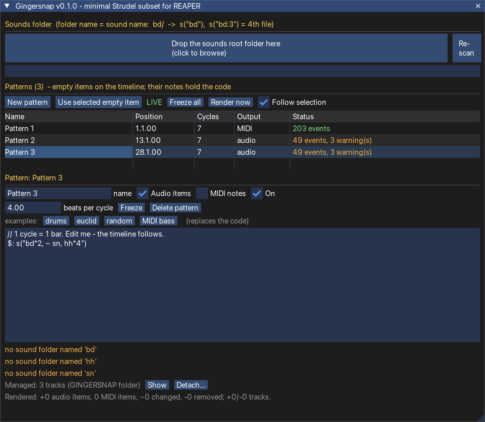

# Gingersnap



**A minimal Strudel subset for REAPER.**

Write **[Strudel](https://strudel.cc) / TidalCycles-style patterns** on your REAPER timeline and have them turned
into real project content: **audio items** cut from your own sample folders and/or **MIDI notes**.

```
$: s("bd(3,8), ~ sn, hh*8").gain(0.8)                      →  items on bd / sn / hh tracks
$: note("<c2 e2 g2 a2>*4").legato(0.5)                     →  a MIDI item with those notes
lead: note("c4 [e4 g4]").off(1/8, x => x.add(note(7)))     →  a second MIDI track, named "lead"
```

It is **not a realtime engine**: a pattern is rendered once into ordinary REAPER items (and re-rendered when you
change something), so you can mix, edit, freeze, print and share the project like any other. The pattern language
is a Lua implementation of Strudel's semantics ([`strudel-lua`](strudel-lua/README.md)) that produces the same
events as real Strudel 1.2.6 on 483 test expressions.

> Gingersnap is an independent project and not affiliated with or endorsed by the Strudel project; "Strudel" names the
> pattern language whose behaviour it reproduces.
>
> **Status: v0.1.0, untested inside real REAPER.** All logic is tested offline against a fake REAPER; the
> REAPER-facing calls, the ReaImGui window and MIDI insertion have never been run in the real program. Read
> [Verified vs. NOT verified](#verified-vs-not-verified) before trusting it with a project you care about.

## Install

Needs **REAPER 6.x/7.x** with **ReaImGui** (ReaPack → *Browse packages* → "ReaImGui"). *js_ReaScriptAPI* is
optional (gives a folder dialog; otherwise drag & drop, typing the path, or a file dialog works).

macOS / Linux: `./install_mac.sh` (copies `Gingersnap.lua` into your REAPER `Scripts/`, removes the download
quarantine flag, registers the action while REAPER is closed, backs up `reaper-kb.ini`; `--portable DIR`,
`--no-register`, `--uninstall`). Anywhere else: *Actions → Show action list → New action → Load ReaScript…* and pick
`dist/Gingersnap.lua` — it is a **single file** with everything bundled.

## Use

1. Run the action **Gingersnap.lua**. The window opens (run it again to close it).
2. **Sounds folder**: drop a folder on the big button (or click it, or type the path). Layout: **one sub-folder per
   sound, the folder name is the sound name**: `sounds/bd/*.wav`, `sounds/sn/*.wav`, `sounds/hh/*.wav`.
3. **New pattern** inserts an **empty item** at the edit cursor (or over the time selection) on the selected track,
   4 cycles long. It *is* the pattern: its notes hold the code, it can be moved, resized, copied, colored, muted.
   (Or insert an empty item yourself, put code in its notes, select it and click *Use selected empty item*.)
4. Edit the code in the window. Clicking a pattern item on the timeline opens it there (*Follow selection*).
   While **LIVE**, changes are rendered a fraction of a second after you stop typing / moving the item.

### What goes where

| In the pattern | Audio result | MIDI result |
|---|---|---|
| `s("bd")` | item from folder `bd` (1st file, case-insensitive name) | GM drum note (bd 36, sn 38, hh 42, oh 46, cp 39 …), channel 10 |
| `s("bd:3")` or `s("bd").n(3)` | the **4th** file of `bd` (0-based, sorted by name, **wraps** modulo) | – |
| `s("bd:3:0.5")` | file 3 with `gain` 0.5 | – |
| `note("c3 e3")`, `n("60 64")` (no `s`) | – | MIDI notes (Strudel naming: `c3` = 48) |
| `.gain(g)` `.velocity(v)` | item volume = g·v | velocity = 127·v·g (default v 0.8) |
| `.pan(0..1)` | take pan | – |
| `.speed(x)` | play rate (pitch follows), item length = file / x | – |
| `.legato(x)` / `.clip(x)` | item cut to x × the event length (short fade) | note length = x × event length |
| `$:` lines / `name:` lines | – | one MIDI track per line (`_$:` mutes a line) |

* **Output per pattern** — the checkboxes *Audio items* / *MIDI notes* (or both) above the editor, same code either way.
* **Time** — one cycle = *beats per cycle* quarter notes (default 4 = a bar of 4/4), so the result follows the
  project's **tempo map**. `setcpm()` / `setcps()` in code are ignored; tempo is REAPER's. Only events whose *start* lies
  inside the pattern item are rendered.
* **Tracks** — everything is generated under a collapsed **GINGERSNAP** folder: one group per sound, one track per file;
  when the *same* sound overlaps itself a duplicate "voice" track (`a (2)`) is added so items never overlap. MIDI
  goes to a **MIDI** group. Tracks and items are found by hidden tags, so you may rename and recolor them.
* **Edits** — an item is only rewritten when *its own wanted state* changes, so a hand-tweaked volume survives other
  edits. *Freeze* (per pattern) turns everything a pattern made into ordinary items and switches it off.
  *Freeze all* stops automatic rendering; *Detach…* releases everything. One undo step per render.
* **Errors** — a mistake shows its line number in red and **pauses rendering**: the previous result stays untouched
  until the code works again. Unknown sounds, ignored controls, notes out of range … are orange warnings.
* **Safety** — code is parsed, never executed as Lua: it cannot touch files or run programs. A pattern is limited to
  20 000 events (`s("bd*512").fast(64)` is refused with a message).

### Cheat sheet

```
s("bd sn")  s("bd*2 [~ sn]")  s("<bd sn>")  s("bd(3,8,2)")  s("bd? hh*8?0.3")  s("{bd sn hh}%4")  s("bd sn . hh hh hh")
s("bd:1 sn:0")   note("c e g")   n("0 .. 7")   n("<0 3>*4")
.fast(2) .slow("<1 2>") .early(1/8) .late(0.25) .rev() .iter(4) .palindrome() .ply(2) .segment(4)
.every(4, x => x.rev())  .off(1/8, x => x.add(note(7)))  .sometimes(x => x.speed(2))  .superimpose(x => x.late(0.02))
.struct("x ~ x x")  .mask("<1 0>")  .euclid(3,8)  .degradeBy(0.3)  .jux(rev)  .chunk(4, x => x.gain(0.4))
.gain(rand.range(0.4, 1))   .pan(sine)   .add("<0 7>")   stack(a, b)   cat(a, b)
```
The complete list, and what is *not* supported (`scale`, `arrange`, chords, …), is in
[`strudel-lua/README.md`](strudel-lua/README.md).

## Verified vs. NOT verified

**Verified offline** (`tools/run_tests.sh`, all green):

* the pattern engine reproduces real Strudel 1.2.6 exactly: 483/483 test expressions incl. seeded randomness,
  polymeter, euclid, `every`, `off`, `jux` …; reference values of the random generator;
* the planner (`GSCore`): sound lookup, `:N` / `n()` wrapping, gain / pan / speed / legato, MIDI pitch and drum
  mapping, voice allocation, event limits, signatures (49 checks);
* the REAPER layer against a **fake** REAPER (80 checks): track / folder structure, tags, keyed diffing, that
  moving / resizing / re-tempo / beats-per-cycle re-render, MIDI items, error pausing, freeze, delete, detach, duplicates,
  no project writes while merely opening the window;
* the bundled single file end to end with a stubbed ReaImGui (15 checks): open, drop a folder, New pattern, type, checkbox, close;
* the installer against a temporary REAPER folder (install, reinstall, uninstall).

**NOT verified — never run in real REAPER** (please test these first, and tell me what breaks):

* the **ReaImGui** window: layout, `InputTextMultiline` (buffer size limit for long code, Tab handling, cursor jumps when
  the text is rewritten from outside), drag & drop of a folder, table/selectable widgets and the function signatures for your
  ReaImGui version (`InputDouble`, `PushTextWrapPos`, …);
* **empty items**: that `P_NOTES` on an item without takes stores and shows the code as expected, that `P_EXT` tags survive
  copy / save / load, that copying a pattern item gives the copy its own GUID and output;
* **MIDI creation**: `CreateNewMIDIItemInProj` + `MIDI_InsertNote` with PPQ positions from `MIDI_GetPPQPosFromProjTime`
  (positions inside tempo changes, note-off ordering, channels);
* **audio**: `D_PLAYRATE` / `B_PPITCH` / `D_PAN` on takes, item lengths at non-1 playrates, formats REAPER cannot decode;
* **tempo maps**: positions are computed per event with `TimeMap2_QNToTime`; only a constant-tempo fake was tested;
* `ReorderSelectedTracks` / folder-depth juggling (code taken over from PrototypeSequence) with many groups;
* **performance** with thousands of items (each render is one undo block and rewrites only changed items, but it has not been timed);
* Windows paths (`\`), non-ASCII sound folder names, sample files longer than a few minutes.

**Known limits**: no `scale()`, `arrange`, chords, `arp`, `cc`; sound-specific pitching (`note("c e").s("piano")`
does not repitch a sample); negative `speed` (reverse) is not supported; every control that only shapes synth sound
(`lpf`, `room`, `delay` …) is accepted and ignored with a warning; one sample folder level only.

## Develop

```
tools/run_tests.sh          # strudel-lua (oracle + units) + plugin (core, sync, bundle); needs lua 5.3+
lua tools/build.lua         # src/ + strudel-lua/src/ -> dist/Gingersnap.lua (the only file users need)
```

`src/GSCore.lua` pure logic · `GSReaper.lua` all `reaper.*` calls · `GSApp.lua` state + tick loop · `GSUI.lua` ReaImGui ·
`strudel-lua/` the pattern engine, usable on its own · `tools/` fake REAPER, ImGui stub, tests.
Modeled on the structure of PrototypeSequence.

## License

**AGPL-3.0-or-later** ([`LICENSE`](LICENSE)). The bundled `strudel-lua` is a Lua implementation of the behaviour of
Strudel (© Strudel contributors, AGPL-3.0-or-later, https://codeberg.org/uzu/strudel) and therefore AGPL itself;
the whole plugin is distributed under the same terms. Strudel is by Alex McLean, Felix Roos and contributors.
